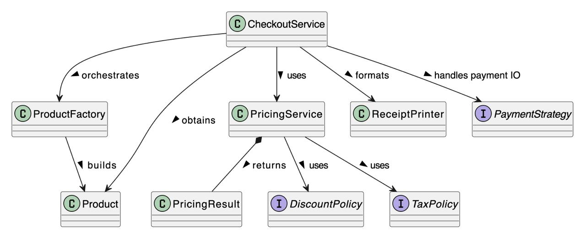
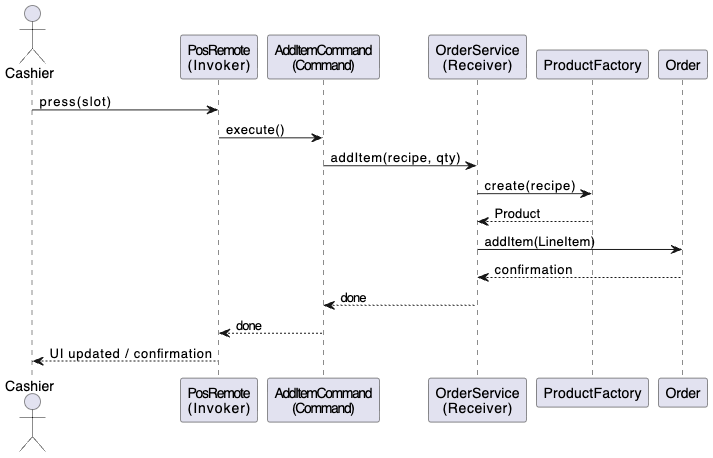

## [Week 2 Reflection]: OOD Principles

**1. Why do we use a dedicated Money class instead of storing prices as double?**

Double uses floating point numbers, which cannot exactly represent decimal values like 0.1, causing precision errors in financial calculations. Money class uses BigDecimal for exact decimal arithmetic and implements the Value Object pattern with immutability and proper equality semantics. Also, immutability offers thread safety, prevents accidental modifications and offers predictable behaviour. Money can be extended to handle multiple currencies and exchange rates. Also, Method signatures like calculateTax(Money amount) are self-documenting, whereas calculateTax(double amount) doesn't indicate the parameter represents money

**2. What benefits do we get from enforcing constraints such as "quantity must be greater than zero"?**

   It enables us to catch errors immediately when creating objects, not later during calculations, it makes it impossible to have invalid orders in the system, enabling us to give the user clean error messages to specify exactly what is wrong.

**3. Did composition feel more natural than inheritance?**

   It does in this case because it makes more sense that an order HAS items, it’s not a type. Also, having loose coupling gives a considerably better coding experience, the dev. Being able to make changes without having to worry of breaking the child class for example. Also, composition offers more clear roles to objects.


## [Week 3 Reflection]: Strategy Pattern

**1. Point to one if/else you avoided in Order by introducing PaymentStrategy**

By introducing PaymentStrategy, we avoided having if/else statements that would check the payment type (if(paymentType=="cash")…else if(paymentType=="card")…else…) inside the Order class in order to choose a behaviour. Instead, the Order class simply delegates to strategy.pay(), allowing each concrete strategy to handle its own payment logic, thus making the code polymorphic and avoiding the chain of if/else statements from growing with each new payment type added.

**2. Show (1–2 sentences) how the same Order can be paid by different strategies in the demo without changing Order code?**

We can see that Order objects always call the same pay method for all payment types. This works because the Order class delegates the payment behavior to the provided strategy, so the execution of the payment can change at runtime without modifying the code inside the Order class.


## [Week 4 Reflection]: Observer Pattern

**1. How does the Observer pattern improve decoupling in the Café POS system?**

By using the observer pattern, we remove the direct dependencies between the Order class and  specific components like KitchenDisplay, DeliveryDesk, and CustomerNotifier. Thus, Order simply publishes events through a common interface. It also creates an independency of the core domain logic from the  presentation and notification jobs, making the system more modular and maintainable.

**2. Why is it beneficial that new observers can be added without modifying the Order class?**

Adding new observers follows the Open/Closed Principle: the system is open for extension but closed for modification. Whenever we need new features, we create a new observer class and register it => no changes to the tested, stable Order class are required. This prevents possibility of ruining correct code and makes the system easier to evolve as requirements change.

**3. Can you think of a real-world system (outside cafés) where Observer is used (e.g., push notifications, GUIs)?**

Stock trading platforms use the Observer pattern at massive scale: when a stock price changes on an exchange, it broadcasts the update to thousands of observers simultaneously. The exchange doesn't know who's subscribed or what they'll do with the data, it just announces "AAPL is now $150.05" and each observer reacts independently. This push-based notification is far more efficient than thousands of clients repeatedly polling for changes, and demonstrates the same decoupling principle as our café Order system.


## [Week 5 Reflection]: Decorator & Factory Patterns

**Which approach (Factory vs Manual Chaining) would you expose to developers using your system, and why?**

I would expose the Factory construction approach to application developers because it provides a way to build complex decorated products using user-friendly input strings instead of nested constructor calls. This approach hides the internal wrapping logic and makes product creation more intuitive and less error-prone. It also makes resulting code easier to scale and maintain, since adding a new modifier or a new size is nothing more than a matter of modifying the factory logic instead of client code.


## Week 6 Refactoring Summary

**Smells Removed:**
- God Class: Split OrderManagerGod into cohesive classes
- Long Method: Extracted pricing, tax, receipt, payment steps
- Primitive Obsession: Replaced string discount codes with DiscountPolicy objects and string payment types with existing PaymentStrategy pattern
- Global State: Eliminated static TAX_PERCENT and LAST_DISCOUNT_CODE
- Feature Envy: Moved discount/tax calculations to dedicated policy classes
- Shotgun Surgery: Centralized pricing logic in policy classes

**Refactorings Applied:**
- Extract Class (DiscountPolicy, TaxPolicy, PricingService, ReceiptPrinter)
- Replace Conditional with Polymorphism (discount types)
- Dependency Injection (constructor injection for all dependencies)
- Remove Global State (eliminated all static variables)

**SOLID Principles Satisfied:**
- Single Responsibility: Each class has one clear purpose
- Open/Closed: Can add new discount types without modifying existing code
- Dependency Inversion: Depends on abstractions (DiscountPolicy, TaxPolicy) not concretions
- Liskov Substitution Principle (LSP): All DiscountPolicy types can substitute safely
- Interface Segregation Principle (ISP): Simple, focused interfaces for pricing/tax

## Testing Strategy
- Characterization tests locked OrderManagerGod outputs
- Unit tests for policies and PricingService validated correctness
- Demo verified new system prints identical receipts

## Extensibility
To add a new discount type (e.g., SeasonalDiscount):
```java
public final class SeasonalDiscount implements DiscountPolicy { 
    // Implementation here
}
```
Create class implementing DiscountPolicy, inject into PricingService constructor. Zero existing code modification required.

## Architecture Summary

CheckoutService orchestrates → ProductFactory builds → PricingService uses DiscountPolicy and TaxPolicy → ReceiptPrinter formats → PaymentStrategy handles payment I/O. No globals, all dependencies injected.


**CheckoutService** → orchestrates the checkout flow
- Coordinates all collaborators: product creation, pricing, receipt formatting, and payment
- No internal logic for tax, discount, or printing, just delegates

**ProductFactory** → builds the Product
- Uses factory & decorator pattern to assemble drinks and add-ons

**PricingService** → uses DiscountPolicy and TaxPolicy
- Computes subtotal, discount, tax, and total
- Returns a PricingResult record containing all computed values

**DiscountPolicy** → defines how discounts are computed
- Implementations: NoDiscount, LoyaltyPercentDiscount, FixedCouponDiscount

**TaxPolicy** → defines how tax is applied
- Implementation: FixedRateTaxPolicy

**ReceiptPrinter** → formats the receipt text for display/printing

**PaymentStrategy** → handles payment I/O
- Implementations: CashPayment, CardPayment, WalletPayment


## [Week 8 Reflection]: Command & Adapter Patterns



**1. Where does Command decouple UI from business logic in your codebase?**

In this design, the PosRemote (the invoker) acts as the user interface but knows nothing about the actual operations being performed. When a button-like slot[0] is pressed, the remote does not know that it's adding an espresso with oat milk. It simply calls the execute() method on whatever command object is currently assigned to that slot.
- The UI component (the button) is unaware of the specific operation; it only knows to trigger a command.
- All core business logic (price calculations, inventory rules, payment processing) is encapsulated within the OrderService (the receiver).
- The commands, such as AddItemCommand, act as a bridge — simple objects that encapsulate the request and link the UI event to the correct business logic.

- This separation ensures the UI can change freely without affecting how the core POS system works.

**2. Why is adapting the legacy printer better than changing your domain or vendor class?**

Changing the domain (ReceiptPrinter or CheckoutService) to accommodate the device-specific byte protocol of LegacyThermalPrinter would break clean design, and editing vendor code would violate encapsulation and maintainability.

Using the LegacyPrinterAdapter instead keeps both sides unchanged, as it translates between the app’s expected interface and the legacy device.

This makes the system flexible, closed to modification but open to extension, exactly as intended by the Adapter pattern.


## [Week 9 Reflection]: Iterator, Composite, State Patterns


**1. Where did you choose ***safety*** over ***transparency*** in your Composite API and why?**

***Answer:*** Safety is chosen in the traversal

CompositeIterator checks the type before descending into the tree, so it never tries to get children from a MenuItem (a leaf)
But nothing stops clients from calling add() or remove() on a leaf if they have direct access to it (those are still guarded by exceptions in MenuComponent)


**2. What new behavior becomes easy with State that was awkward with conditionals?**

***Answer:*** Switching between states becomes easy.
- The OrderFSM object delegates work to its current state, so the behaviour of each method depends on which state it is in.
- Each state encapsulates its own valid transitions, removing the need for central if(state==X) checks.
- This makes it simple to change behavior dynamically and prevents illegal actions cleanly.
